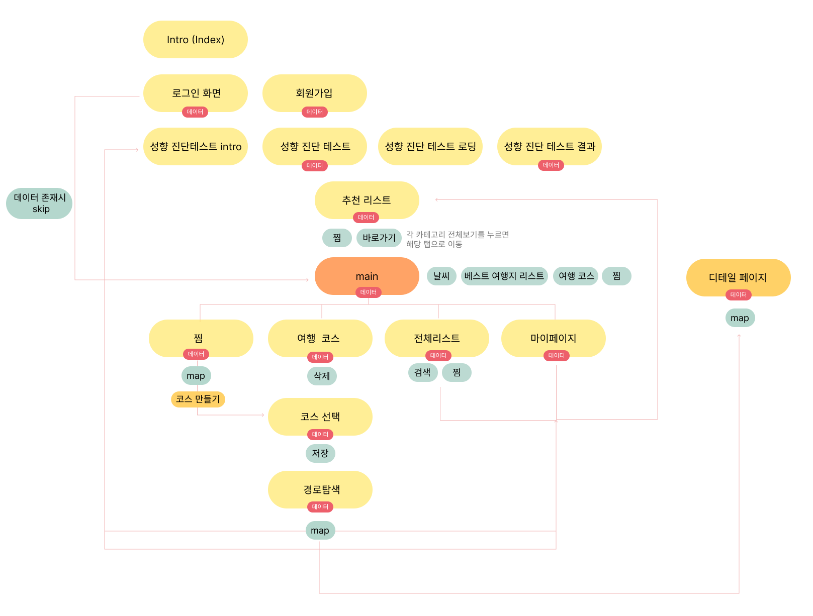

# Team-Project - JeJePick
팀 프로젝트로 진행한 제주도 관광 어플 제제픽입니다.
- 성향테스트를 통해 제주도 관광지를 추천받고 추천받은 관광지를 토대로 코스를 기획할 수 있는 어플

## 팀원 - 6명 
권오성, 김호성, 박정아, 이지영, 조자룡, 홍민경

## 사용 API 
1. 비짓제주 관광정보 OPEN API
   [제주도 관광/숙박/맛집 OPEN API](https://www.visitjeju.net/kr/visitjejuapi)
2. 기상청 단기예보 조회서비스
   [공공데이터포털-날씨 API](https://www.data.go.kr/tcs/dss/selectApiDataDetailView.do?publicDataPk=15084084)
3. 카카오 맵 API
   [카카오 맵 RestAPI / Javascript](https://apis.map.kakao.com/)

## 제제픽 흐름도 

## Deploy on Vercel

The easiest way to deploy your Next.js app is to use the [Vercel Platform](https://vercel.com/new?utm_medium=default-template&filter=next.js&utm_source=create-next-app&utm_campaign=create-next-app-readme) from the creators of Next.js.
Check out our [Next.js deployment documentation](https://nextjs.org/docs/deployment) for more details.
